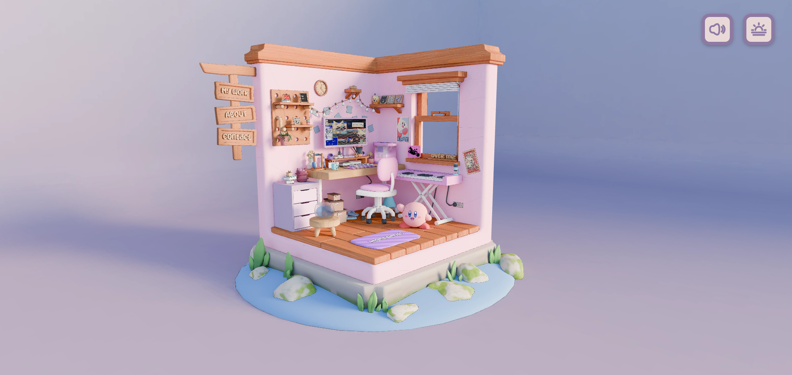

#  3D Portfolio Room

Room Portfolio is an interactive 3D personal portfolio built as an isometric room scene, where visitors can explore my work and hobbies through clickable objects, animated shaders, ambient audio, and a day/night theme toggle. Instead of a traditional scrolling page, the portfolio is presented as a small living space filled with details — a laptop, a piano, a bookshelf, photos — each one revealing a piece of information about me when interacted with.

This was my **first experience working with 3D graphics and Three.js**. I built it while following [this YouTube tutorial](https://youtu.be/tdsQwuyS6DQ?si=78VlvZTQSuXFU9yH), learning the fundamentals of 3D scenes, materials, shaders, lighting, and animation along the way, and then extending it with my own content, assets, audio, and styling.

<div style="display: flex; flex-wrap: wrap; justify-content: space-around; gap: 1%;">
  
</div>

## Features

- **Interactive 3D room**: A fully modeled and textured isometric room built with Three.js, with clickable objects that open information about me.

- **Custom shaders**: Hand-written GLSL shaders (smoke effect, day/night theme transition) for atmosphere and visual polish.

- **Day/Night theme toggle**: Smooth shader-driven transition between day and night lighting and textures.

- **Ambient audio & sound effects**: Background music and interactive sound effects (piano keys, clicks) powered by Howler.js.

- **Smooth animations**: Camera movement, object transitions, and UI animations handled with GSAP.

- **Custom fonts & styling**: Custom typefaces and SCSS-based responsive styling for the interface overlaying the 3D scene.

- **Orbit-style camera controls**: Custom controls for navigating and exploring the room from different angles.

## Tech Stack

- **3D / Rendering**: Three.js, custom GLSL shaders, Draco compression for models.
- **Animation**: GSAP.
- **Audio**: Howler.js.
- **Styling**: Sass (SCSS), include-media.
- **Build Tool**: Vite (with vite-plugin-glsl for shader imports).
- **Language**: JavaScript.

## Installation

To run this project locally, follow these steps:

1.  **Clone the repository:**
    ```bash
    git clone https://github.com/OstapMaksymiv/3d-portfolio.git
    cd 3d-portfolio
    ```

2.  **Install dependencies:**
    ```bash
    npm install
    ```

3.  **Start the development server:**
    ```bash
    npm run dev
    ```
    The app will run on the local address printed in the terminal (Vite's default is `http://localhost:5173`).

4.  **Build for production:**
    ```bash
    npm run build
    ```

5.  **Preview the production build:**
    ```bash
    npm run preview
    ```

## Project Structure

```
room-portfolio/
├── public/
│   ├── audio/       # Music and sound effects
│   ├── draco/        # Draco decoder for compressed models
│   ├── fonts/        # Custom typefaces
│   ├── images/       # UI and preview images
│   ├── media/         # Favicons and manifest assets
│   ├── models/        # 3D room model (.glb)
│   ├── shaders/      # Shader textures (e.g. perlin noise)
│   └── textures/     # Day/night room textures
└── src/
    ├── shaders/       # GLSL fragment/vertex shaders
    ├── styles/        # SCSS styles
    ├── utils/         # Utility classes (e.g. OrbitControls)
    └── main.js        # Application entry point
```

## Development Conventions

*   **Language:** JavaScript (ES modules).
*   **Build Tool:** Vite, with `vite-plugin-glsl` for importing `.glsl` shader files directly.
*   **Styling:** SCSS organized into `defaults`, `fonts`, `reset`, and `variables` partials.
*   **Assets:** 3D models are Draco-compressed for smaller file sizes; textures are served in `.webp` for performance.

## Credits

*   Built by following [this Three.js room tutorial](https://youtu.be/tdsQwuyS6DQ?si=78VlvZTQSuXFU9yH) as a learning project, then customized with personal content, assets, and styling.

## Contributing

This is a personal learning/portfolio project, but suggestions are welcome:

1.  Fork the repository.
2.  Create a new branch (`git checkout -b feature-branch`).
3.  Make your changes and commit them (`git commit -am 'Add new feature'`).
4.  Push to the branch (`git push origin feature-branch`).
5.  Open a pull request.
